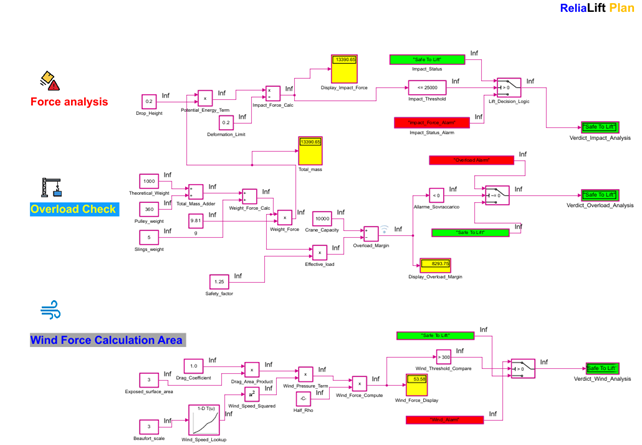

# Simulift

**Predictive Safety Model for Lifting Operations**  
Built in MATLAB Simulink – created by [Gianluigi Riccardi](https://www.linkedin.com/in/gianluigiriccardi)

---

## 🚀 Overview

**Simulift** is a predictive safety tool designed to simulate real lifting conditions using physics-based logic.  
It checks whether a lift is safe by evaluating:

- **Impact force** (from drop height & deformation)
- **Overload** (mass vs crane capacity with safety factor)
- **Wind force** (based on Beaufort scale)

Final verdicts like ✅ **Safe to Lift** or ❌ **Overload Detected** are clearly shown via visual displays.

---

## 📦 Download

[Download SimuLift.slx](https://github.com/GianluigiRiccardi/SimuLift/raw/main/Simulift/SimuLift.slx)

---

## 📊 Example Scenario

Lifting a 3000 kg payload during wind force 6 (Beaufort):

- Set slings, pulley, and load weight
- Apply deformation limit: 0.2 m  
- Safety Factor: 1.25  
- Exposed area: 1.5 m²

Run the model and observe the visual verdict.

---

## 🔧 Parameters You Can Modify

| Parameter            | Block Name            | Affects                         |
|---------------------|------------------------|---------------------------------|
| Payload              | `Theoretical_Weight`   | Load force                      |
| Pulley               | `Pulley_Weight`        | Total mass                      |
| Slings               | `Slings_Weight`        | Total mass                      |
| Safety Factor        | `Safety_Factor`        | Load * multiplier               |
| Drop Height          | `Height`               | Impact energy                   |
| Deformation limit    | `Deformation_Limit`    | Impact force                    |
| Beaufort Scale       | `Beaufort_Scale`       | Wind speed                      |
| Exposed Area         | `Exposed_Area`         | Wind pressure                   |

---

## 🖥 Output Verdicts

- **Green = OK**
- **Red = Alarm**

| Display Block         | Shows                  |
|-----------------------|------------------------|
| `Impact_Status`       | Impact risk            |
| `Overload_Status`     | Load/capacity risk     |
| `Wind_Status`         | Wind force condition   |
| `FinalVerdict_Display`| Global lift verdict    |

---

## 📚 Resources

- [Simulink Documentation](https://www.mathworks.com/help/simulink/)
- [Beaufort Wind Scale](https://en.wikipedia.org/wiki/Beaufort_scale)
- [OSHA Crane Lifting Standards](https://www.osha.gov/cranes-derricks)

---

## 🔄 Changelog

**v1.0 – May 2025**  
- Full predictive model  
- 3 safety subsystems  
- GitHub Pages and documentation added

---

## 🌐 GitHub Page

View the public version of this project:  
https://gianluigiriccardi.github.io/SimuLift/

---

## 🛡️ License

MIT License – use, adapt, and contribute freely.
